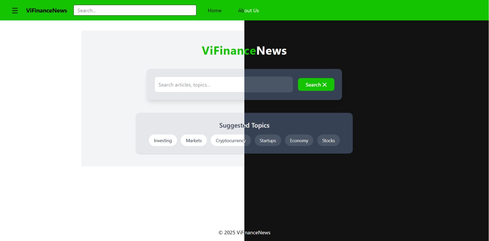

# Web for ViFinance News

This is a web-app build for [the course project of CS3332](https://github.com/DTJ-Tran/VifinanceNews)

## 📸 Demo (In Progressing)



## 🚀 Features

- Vite + React
- Tailwind CSS v4.1
- Flask Python

## Current State
- Frontend in state of testing and implemented with the backend project

## 🛠️ Installation
- Prerequisites  
    - [Node.js](https://nodejs.org/en/download)  
    - [Python v3.x](https://www.python.org/downloads/) (if use the testing server)

- Current used version  
    - Node.js v20.18.0
    - Python v3.13 for the server testing
    - Python v3.11 for the backend project

### Linux
- Clone the repo
```bash
git clone https://github.com/Pluck3dEye/Web-for-ViFinance-News.git
```
- Extract the downloaded file
```
unzip <file-name>
```

- Go into the project directory
```bash
cd Web-for-ViFinance-News
```

- Install dependencies (if applicable)
```bash
npm install 
```

- For install the server 
```bash
python3 -m venv .venv
source ./.venv/bin/activate
pip install -r requirements.txt 
```

- Run the app
```bash
npm run dev # Web
flask run # Server
```

# Log

- [Log fix 1 6/5/2025](https://gist.github.com/Blindn3ss/e2fbb6ecc9437e8c0ffe321314612521) 


# Note
⚠️ This project was created as a team effort for academic purposes.
Frontend and partial backend were developed by [Dung "pluck3deye" Nguyen](https://github.com/Pluck3dEye).
